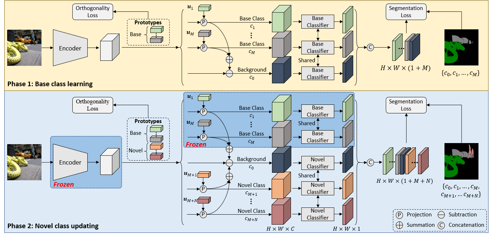

# POP for Generalized Few-shot Semantic Segmentation
This repository is for the CVPR2023 paper "Learning Orthogonal Prototypes for Generalized Few-shot Semantic Segmentation".

<div align="center">
  
</div>

## Requirements
The code is verified with Python 3.6 and PyTorch 1.8. It also relies on NumPy and OpenCV.

## Datasets
Please refer to [PFENet](https://github.com/dvlab-research/PFENet) to get PASCAL VOC with SBD and COCO 2014. The ground truth images for COCO 2014 can be generated using `utils/coco_parse_script.py`. Data paths should be as follows:
```
.{YOUR_PASCAL_PATH}
├── JPEGImages
├── SegmentationClassAug

.{YOUR_COCO_PATH}
├── train2014
├── train_no_crowd
├── val2014
├── val_no_crowd
```
After the first stage training, the code will save the filenames for each class as txt files in `dataset/list/`. Then, you can use `utils/gen_fs_list.py` to select few-shot data for the second stage training with different random seeds.

## Pretrained Models
Download ImageNet pretrained ResNet-50 [here](https://drive.google.com/file/d/1w5pRmLJXvmQQA5PtCbHhZc_uC4o0YbmA/view). Check [models](./MODELS.md) to get pretrained POP models.

## Usage
### Training
POP performs two-stage training for generalized few-shot semantic segmentation.
#### Stage 1: Base Class Learning
We use 1 GPU to train a base model on PASCAL-5i and 4 GPUs on COCO-20i. Run the training code with `scripts/train_coco_fold0_base_q.sh` and `scripts/train_voc_fold0_base.sh`. You should modify the arguments according to your settings. Note that you should specify `YOUR_RESTORE_PATH` as the path to ImageNet-pretrained ResNet-50 models.
#### Stage 2: Novel Class Updating
Run the training code with `scripts/ft_coco.sh` and `scripts/ft_voc.sh` with modified arguments according to your settings. While `ft_pop.py` also supports larger batch size with multi-gpu training, we find small batch size often works better. Note that you should specify `YOUR_RESTORE_PATH` as the path to the base models trained in Stage 1. You can also finetune them on different support data by setting multiple random seeds.
#### FP16 Training
To additionally speed up the training process, we support mix precision training in `train_base.py` and `ft_pop.py`, which can significantly reduce the time cost. To enable it, you can add `--fp16` in the training scripts.
### Testing
Use `scripts/evaluate_coco_fold0.sh` and `scripts/evaluate_voc_fold0.sh` to perform GFSS evaluation on the two datasets.

## References
This repo is mainly built based on [PFENet](https://github.com/dvlab-research/PFENet) and [GFS-Seg](https://github.com/dvlab-research/GFS-Seg). Thanks for their great work!

## Citation
If you find our code useful, please consider to cite with:
```
@inproceedings{liu2023learning,
  title={Learning Orthogonal Prototypes for Generalized Few-shot Semantic Segmentation},
  author={Liu, Sun-Ao and Zhang, Yiheng and Qiu, Zhaofan and Xie, Hongtao and Zhang, Yongdong and Yao, Ting},
  booktitle={Proceedings of the IEEE/CVF Conference on Computer Vision and Pattern Recognition},
  year={2023}
}
```
